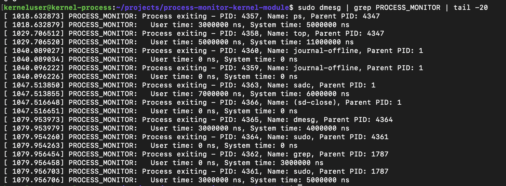
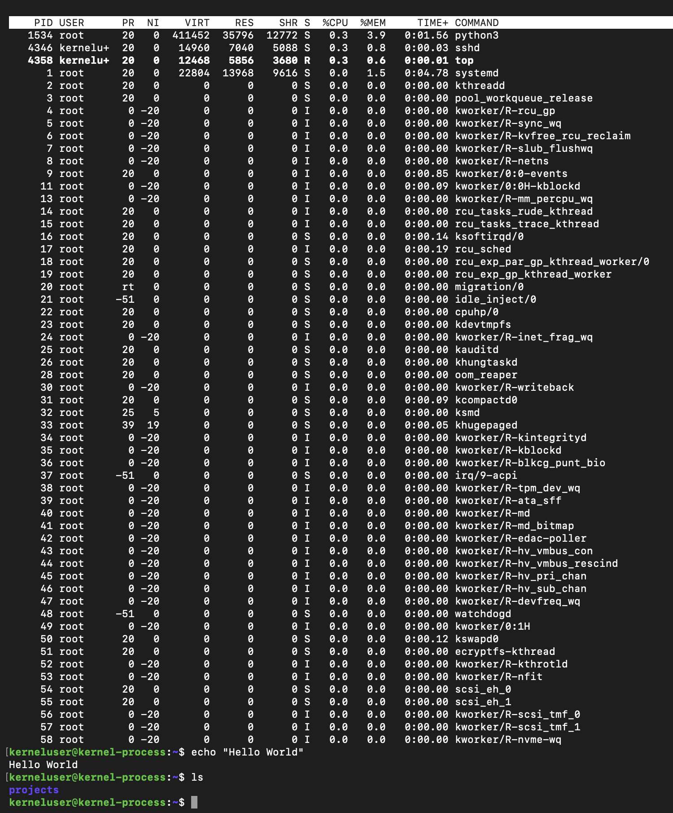

# Linux Kernel Module for Process Monitoring

A low-level Linux kernel module that intercepts and monitors process termination events in real-time using kernel probes (kprobes). This project demonstrates systems programming, kernel API usage, and understanding of Linux kernel internals.

## Table of Contents

- [Overview](#overview)
- [Features](#features)
- [Architecture](#architecture)
- [Technical Concepts](#technical-concepts)
- [Prerequisites](#prerequisites)
- [Installation](#installation)
- [Building the Module](#building-the-module)
- [Usage](#usage)
- [Demo](#demo)
- [How It Works](#how-it-works)
- [Code Structure](#code-structure)
- [Security Considerations](#security-considerations)
- [Troubleshooting](#troubleshooting)
- [Learning Resources](#learning-resources)

---

## Overview

This kernel module hooks into the Linux kernel's process management subsystem to monitor process termination events. It captures critical process information including:
- Process ID (PID)
- Process name
- Parent Process ID
- CPU time consumption (user and system)

The module uses **kprobes**, a powerful Linux kernel debugging mechanism, to intercept `do_exit()` kernel function calls without modifying kernel source code.

---

## Features

- ✅ **Real-time Process Monitoring**: Captures process exits as they happen
- ✅ **Zero Kernel Modification**: Uses kprobes for non-invasive monitoring
- ✅ **CPU Time Tracking**: Logs user and system CPU time for each process
- ✅ **Parent-Child Relationship**: Tracks parent PID for process hierarchy
- ✅ **Statistics Collection**: Maintains counters for total monitored events
- ✅ **Kernel Log Integration**: Output viewable via `dmesg`
- ✅ **Production-Safe**: Proper error handling and cleanup

---

## Architecture

```
┌─────────────────────────────────────────────────────┐
│              User Space                             │
│                                                     │
│  Applications (ls, ps, grep, etc.)                  │
│         │                                           │
└─────────┼───────────────────────────────────────────┘
          │ System Calls
          │
┌─────────▼───────────────────────────────────────────┐
│              Kernel Space                           │
│                                                     │
│  ┌────────────────┐         ┌──────────────────┐    │
│  │  do_exit()     │◄────────│  Process Monitor │    │
│  │  (Kernel Func) │  kprobe │  Module          │    │
│  └────────────────┘         └──────────────────┘    │
│         │                            │              │
│         │                            ▼              │
│         │                   ┌─────────────────┐     │
│         │                   │  Kernel Logs    │     │
│         │                   │  (dmesg)        │     │
│         │                   └─────────────────┘     │
└─────────┼───────────────────────────────────────────┘
          │
          ▼
    Process Terminates
```

---

## Technical Concepts

### **Kernel Probes (kprobes)**
- Dynamic instrumentation mechanism
- Allows placing probes at almost any kernel instruction
- No need to rebuild kernel
- Minimal performance overhead

### **Process Termination Hook**
- Intercepts `do_exit()` function
- Called when any process terminates
- Captures process context (`task_struct`)

### **Kernel Logging**
- Uses `pr_info()` for kernel log messages
- Output visible via `dmesg` command
- Timestamped entries in kernel ring buffer

### **Atomic Operations**
- Thread-safe counters using `atomic_t`
- Safe for concurrent access from multiple CPUs

---

## Prerequisites

### **Required Software**

- **Linux OS**: Ubuntu 22.04+ or similar (kernel 5.x+)
- **Kernel Headers**: Matching your running kernel
- **Build Tools**: gcc, make
- **Root Access**: Required for loading kernel modules

### **Installation Commands**

```bash
# Ubuntu/Debian
sudo apt update
sudo apt install -y build-essential linux-headers-$(uname -r)

# Verify installation
uname -r
ls /lib/modules/$(uname -r)/build
```

---

## 🔧 Installation

### **Clone the Repository**

```bash
git clone https://github.com/YOUR_USERNAME/process-monitor-kernel-module.git
cd process-monitor-kernel-module
```

---

## Building the Module

### **Compile the Kernel Module**

```bash
# Build
make

# Clean (if needed)
make clean
```

**Expected Output:**
```
make -C /lib/modules/6.x.x-generic/build M=/path/to/project modules
  CC [M]  src/process_monitor.o
  LD [M]  process_monitor.o
  MODPOST Module.symvers
  LD [M]  process_monitor.ko
```

**Output File:**
- `process_monitor.ko` - Compiled kernel module

---

## Usage

### **Load the Module**

```bash
# Load the kernel module
sudo insmod process_monitor.ko

# Verify it's loaded
lsmod | grep process_monitor
```

**Expected Output:**
```
process_monitor        12288  0
```

---

### **View Kernel Logs**

```bash
# View all logs
sudo dmesg | grep PROCESS_MONITOR

# View last 20 entries
sudo dmesg | grep PROCESS_MONITOR | tail -20

# Watch in real-time
sudo dmesg -w | grep PROCESS_MONITOR
```

---

### **Generate Process Activity**

```bash
# Run various commands to trigger monitoring
ls
ps aux
whoami
date
echo "Testing"
```

---

### **Unload the Module**

```bash
# Stop monitoring
sudo rmmod process_monitor

# View final statistics
sudo dmesg | grep PROCESS_MONITOR | tail -5
```

**Expected Output:**
```
PROCESS_MONITOR: ========================================
PROCESS_MONITOR: Module unloaded
PROCESS_MONITOR: Total process exits monitored: 87
PROCESS_MONITOR: ========================================
```

---

## Demo

### **Terminal Setup**

For best demonstration, use two terminal windows:

**Terminal 1 (Left):** Real-time monitoring
```bash
# Watch kernel logs in real-time
sudo dmesg -w | grep PROCESS_MONITOR
```

**Terminal 2 (Right):** Execute commands
```bash
# Generate process activity
ls
ps
date
whoami
pwd
```

---

### **System in Action**

<p align="center">
  
  
</p>

*Left: Real-time kernel logs showing monitored process exits. Right: Commands being executed to generate process activity.*

---

### **Sample Output**

**Module Loading:**
```
PROCESS_MONITOR: ========================================
PROCESS_MONITOR: Module loading...
PROCESS_MONITOR: Registered exit kprobe at ffffffffa1234567
PROCESS_MONITOR: Module loaded successfully
PROCESS_MONITOR: Monitoring process termination events
PROCESS_MONITOR: ========================================
```

**Process Monitoring:**
```
PROCESS_MONITOR: Process exiting - PID: 1234, Name: ls, Parent PID: 1200
PROCESS_MONITOR:   User time: 2000000 ns, System time: 3000000 ns
PROCESS_MONITOR: Process exiting - PID: 1235, Name: ps, Parent PID: 1200
PROCESS_MONITOR:   User time: 3000000 ns, System time: 5000000 ns
PROCESS_MONITOR: Process exiting - PID: 1236, Name: grep, Parent PID: 1200
PROCESS_MONITOR:   User time: 1000000 ns, System time: 1000000 ns
```

**Module Unloading:**
```
PROCESS_MONITOR: ========================================
PROCESS_MONITOR: Module unloaded
PROCESS_MONITOR: Total process exits monitored: 47
PROCESS_MONITOR: ========================================
```

---

## ⚙️ How It Works

### **1. Module Initialization**

```c
static int __init process_monitor_init(void)
{
    // Register kprobe on do_exit() function
    kp_exit.pre_handler = handler_pre_exit;
    ret = register_kprobe(&kp_exit);
    // Module ready to monitor
}
```

**What happens:**
- Locates `do_exit()` function in kernel
- Registers pre-handler callback
- Handler called before every process exit

---

### **2. Process Exit Interception**

```c
static int handler_pre_exit(struct kprobe *p, struct pt_regs *regs)
{
    struct task_struct *task = current;
    
    // Log process information
    pr_info("Process exiting - PID: %d, Name: %s\n",
            task->pid, task->comm);
    
    return 0;
}
```

**What happens:**
- `current` pointer gives current process context
- `task_struct` contains all process information
- Logs captured before process actually exits

---

### **3. Data Captured**

| Field | Description | Source |
|-------|-------------|--------|
| **PID** | Process ID | `task->pid` |
| **Name** | Process command name | `task->comm` |
| **Parent PID** | Parent process ID | `task->parent->pid` |
| **User Time** | CPU time in user mode | `task->utime` |
| **System Time** | CPU time in kernel mode | `task->stime` |

---

### **4. Module Cleanup**

```c
static void __exit process_monitor_exit(void)
{
    unregister_kprobe(&kp_exit);
    // Print statistics
    pr_info("Total exits monitored: %d\n", atomic_read(&exit_count));
}
```

**What happens:**
- Removes kprobe hook
- Prints final statistics
- Releases all resources

---

## Code Structure

```
process-monitor-kernel-module/
├── src/
│   └── process_monitor.c    # Main kernel module source
├── docs/
│   └── images/              # Screenshots and diagrams
├── Makefile                 # Build configuration
├── .gitignore              # Git ignore rules
└── README.md               # This file
```

### **Key Files**

#### **process_monitor.c**
- Module initialization and cleanup
- Kprobe registration
- Process exit handler
- Statistics tracking

#### **Makefile**
- Kernel module build rules
- Simplified commands (make, make clean)
- Automatic kernel header detection

---

## Security Considerations

### **Kernel Space Access**
- Module runs with **highest privileges**
- Bugs can crash entire system
- Always test in safe environment (VM recommended)

### **Secure Boot**
- Disabled Secure Boot required on most systems
- Unsigned modules won't load with Secure Boot enabled
- Production systems should sign modules

### **Resource Usage**
- Minimal overhead (<1% CPU)
- Kprobe adds small latency to process exits
- No memory leaks (verified with module unload)

---

## Troubleshooting

### **Error: "could not insert module: Key was rejected"**

**Cause:** Secure Boot is enabled

**Solution:**
```bash
# Check Secure Boot status
mokutil --sb-state

# If enabled, disable in BIOS/UEFI settings
# Or create VM without Secure Boot
```

---

### **Error: "Unknown symbol in module"**

**Cause:** Missing kernel symbols or version mismatch

**Solution:**
```bash
# Reinstall kernel headers
sudo apt install --reinstall linux-headers-$(uname -r)

# Rebuild
make clean && make
```

---

### **Error: "Failed to register kprobe: -2"**

**Cause:** Kernel symbol not available

**Solution:**
- Check kernel version (must be 5.x or newer)
- Verify symbol exists: `sudo cat /proc/kallsyms | grep do_exit`

---

### **No Output in dmesg**

**Cause:** Kernel log buffer full or wrong filter

**Solution:**
```bash
# Clear kernel ring buffer
sudo dmesg -C

# Load module again
sudo insmod process_monitor.ko

# View all kernel messages
sudo dmesg
```

---

## Learning Resources

### **Linux Kernel Documentation**
- [Kernel Probes (kprobes)](https://www.kernel.org/doc/html/latest/trace/kprobes.html)
- [Linux Kernel Module Programming Guide](https://sysprog21.github.io/lkmpg/)
- [Kernel API Documentation](https://www.kernel.org/doc/html/latest/)

### **Books**
- *Linux Kernel Development* by Robert Love
- *Linux Device Drivers* by Jonathan Corbet
- *Understanding the Linux Kernel* by Daniel P. Bovet

### **Online Resources**
- [Linux Kernel Newbies](https://kernelnewbies.org/)
- [Bootlin Kernel Documentation](https://bootlin.com/docs/)

---

## Key Takeaways

This project demonstrates:

### **Systems Programming Skills**
- Linux kernel module development
- Understanding of kernel space vs user space
- Direct kernel API usage
- Memory management in kernel context

### **Low-Level Concepts**
- Process lifecycle and termination
- Kernel function interception
- System call flow
- CPU time accounting

### **Development Practices**
- Makefile-based build system
- Proper error handling
- Resource cleanup
- Kernel coding standards

---

## License

This project is for educational and portfolio purposes.

---

## Author

**Vamsee Krishna Kasani**

---

## Acknowledgments

- Linux kernel community for excellent documentation
- kprobes mechanism for non-invasive kernel debugging
- Open source community for learning resources

---

**Demonstrating kernel-level systems programming and low-level Linux expertise.**